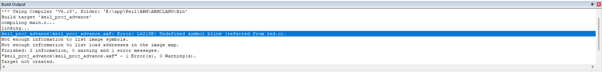
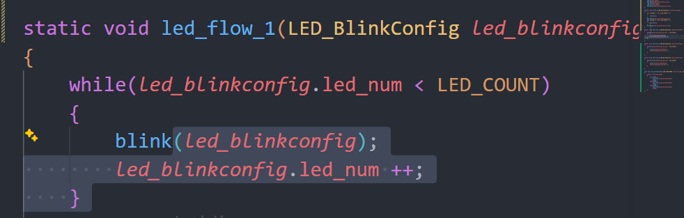

# 调试日志

## 调试过程描述
在完成遥控流水灯状态机时，出现如图所示的报错

报错提示是undefined symbol blink，由于知道blink是个函数，所以此处问题是函数未定义
于是我在VScode中使用ctrl+shift+F快速查找blink，发现我将原本的blink函数修改为了blink_1，但是仍在led_flow_1()函数中使用了原本的blink()函数（如图）

因此最终通过将图中的blink改为blink_1修复了报错

